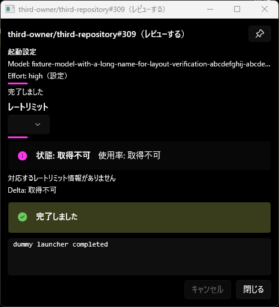
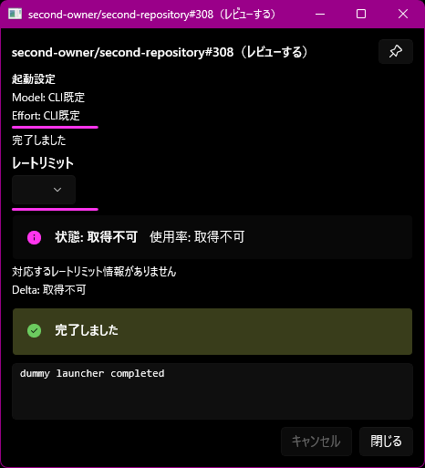

# ライブログの起動設定表示（#478）

ライブログの「起動設定」にModelとEffortを表示する。これは起動引数・設定ファイルから得た選択値であり、CLIが実行中に報告した使用モデルではない。取得元は「引数」「設定」「環境」、不明な項目は「CLI既定」と表示する。ModelとEffortは独立して解決する。

## 取得経路

| CLI | 引数 | 設定ファイル |
|---|---|---|
| agy | --model、--effort | ~/.gemini/antigravity-cli/settings.jsonのmodel。#477の取得結果を再利用 |
| Claude | --model、--effort、--settings | ~/.claude/settings.json、作業ディレクトリの.claude/settings.json・settings.local.json。model、effortLevel、モデル名が一致するmodelSettingsのeffortLevel |
| Copilot | --model、--reasoning-effort | ~/.copilot/settings.jsonのmodel・effortLevel。信頼済み作業ディレクトリの.github/copilot/settings.json・settings.local.json |
| Codex | -m/--model、-c/--configのmodel・model_reasoning_effort | ~/.codex/config.toml、--profileで選択した<name>.config.toml、信頼済みプロジェクトの.codex/config.toml |

CODEX_HOME、CLAUDE_CONFIG_DIR、COPILOT_HOMEによる設定ディレクトリ変更も反映する。ClaudeのANTHROPIC_MODEL・CLAUDE_CODE_EFFORT_LEVEL（シェルまたは設定env）を参照し、--setting-sourcesによる読み込み対象の制限、--settingsのJSON/ファイル指定を反映する。Codexの--ignore-user-configと-C/--cdも参照する。

引数を優先する。未指定の項目は設定で補い、プロジェクト・ローカル設定はユーザー設定より優先する。Codexはprofileよりプロジェクト設定を優先し、近いディレクトリが優先される。--config内のmodelと--modelの両方がある場合は--modelを優先する。

通常起動/resumeの実引数と作業ディレクトリをGetLaunchInfoAsyncで取得する。値は起動時に保持し、設定変更で既存ウィンドウの表示を書き換えない。設定ファイルには書き込まない。

## 表示と検証範囲

長い値は省略表示し、tooltipで全文を確認できる。改行は空白にし、既存SecretMaskerでマスクする。設定不在はCLI既定、不正形式・アクセス失敗は文脈付きログに記録する。ファイルの内容や例外に含まれる設定値をログへ出さない。

モデルの別名を実モデル名へ展開したり、クラウド/MDM管理設定やresume履歴を読んだりはしない。実行中のモデル切替・CLI内部のfallbackはこの表示へ追従しない。CLIはプリセットと既知の実行ファイル名（絶対パス指定も含む）から判定する。任意名のカスタムwrapperでは共通の明示引数を参照できるが、固有の設定ファイルは推測しない。

JSONはSystem.Text.Json、TOMLはTomlyn 2.10.1で解析する。TOMLの引用符・コメント・テーブルを正しく扱うため、独自の行パーサーは作らない。

## 参照

- [Claude設定の優先順位](https://code.claude.com/docs/en/settings)
- [Copilot設定ファイルと優先順位](https://docs.github.com/en/copilot/reference/copilot-cli-reference/cli-config-dir-reference)
- [Codex設定の優先順位](https://developers.openai.com/codex/config-basic/)
- [agy CLI設定](https://antigravity.google/docs/cli/settings/)
- [Tomlyn](https://github.com/xoofx/Tomlyn/tree/2.10.1)
## 実画面の検証（2026-10-07）

対象コードSHAは `34803ad1c273c529bc0f2529a2475a669f5f3681`、ProductVersionは `0.17.0+34803ad1c273c529bc0f2529a2475a669f5f3681`。fake Gateway・dummy subscriber・dummy launcherと独立したCODEX_HOMEを使用した。fixtureのmodelとeffortだけを読み、本番のGitHub資格情報は渡していない。

- 既定の小型ライブログ（480×520論理サイズ）で、長いモデル名が省略され、Effort highと取得元「設定」が表示された。ヘッダー・状態・レートリミット・ログ・ボタンの配置は維持された。
- fixtureの設定ファイルを空にしても既存ウィンドウの表示は保持された。次に開いたウィンドウではModel/Effortとも「CLI既定」になった。
- tooltipポップアップは今回の画面操作環境で観測できなかった。文字列の配線は実装済みだが、tooltip実表示と既定サイズより小さいウィンドウでの表示は未確認。
- Stop-RunbookEnvironmentで `isolated=true`、`findings=[]`、`realSettingsUnchanged=true`を確認し、fixtureを停止した。
- 初回のfixture確認で絶対パスCLIが識別されないことを検出し、表示用判定をレートリミット対応から分離した。上記の画面証跡は修正後のSHAに対するもの。

設定ファイルの値:

未指定時:

この記録と画像の追加では製品コードを変更していない。リリース用の別セッション実行ランブックではなく、常駐版への配布・公開は未実施。
