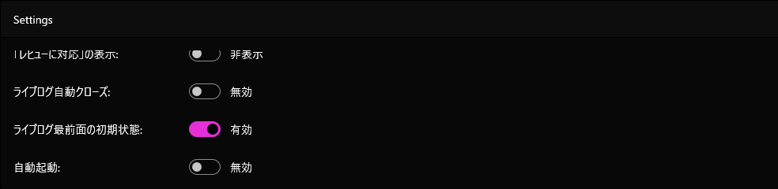
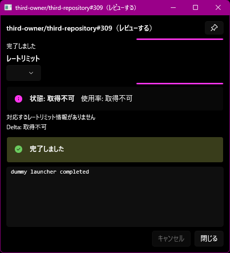
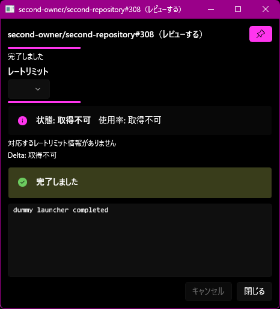
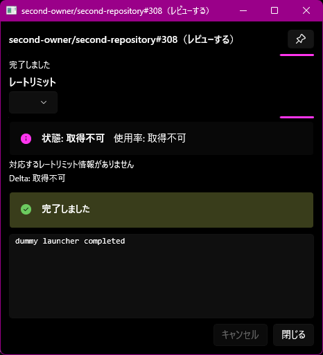

# ライブログ最前面の初期設定の検証（#476）

2026-10-06に隔離アプリを実デスクトップで確認した。対象コードは `0d8fd0d8f7cc389a3b9cd19ed956b3ca98fa6f43`（ProductVersion `0.17.0+0d8fd0d8f7cc389a3b9cd19ed956b3ca98fa6f43`）。この記録と画像の追加後、製品コードは変更していない。

## 実装と適用範囲

設定「ライブログ最前面の初期状態」は既定で無効。起動時の設定値をViewModelへ渡し、新しいウィンドウの `PinToggle.IsChecked` と `OverlappedPresenter.IsAlwaysOnTop` に同じ値を反映する。既存ウィンドウには変更を適用せず、ウィンドウ上の個別切替も既定設定を変更しない。

## 実画面の結果

`Start-RunbookEnvironment.ps1` のfake Gateway・dummy subscriber・dummy launcherと隔離データを使用した。GitHub資格情報はテスト用プロセスへ渡していない。

| 確認 | 結果 |
|---|---|
| 既定無効で新規表示 | fixture PR #309のピンがオフ |
| 設定UIを有効に変更 | トグルが有効、隔離settings.jsonの `LiveLogAlwaysOnTopEnabled` がtrue |
| 既存ウィンドウ | #309はオフを維持 |
| 設定有効後の新規表示 | fixture PR #308のピンが最初からオン |
| 個別切替 | #308でオン→オフ→オンを確認、永続設定はtrueのまま |
| 隔離環境の停止 | `isolated=true`、`findings=[]`、`realSettingsUnchanged=true`。残存dummy subscriberも停止 |

既存仕様ではライブログを一つずつ表示する。#308の実行は#309が開いている間に終了し、#309を閉じた後に#308がオンで表示された。設定値はセッション起動時に保持する。ピン状態は画面で確認したが、別アプリとの重なりによる最前面順序の独立計測は行っていない。

### 画面証跡

設定が有効:

既定無効で開いたウィンドウ:

設定有効後に開いたウィンドウ:

個別にオフへ切り替えたウィンドウ:

## 自動検証

- `SettingsServiceTests`: 既定false、true/falseの保存・再読み込み。
- `SettingsInputCoordinatorTests`: 初期化時の保存抑止と設定変更。
- `ReviewStartCoordinatorTests`: reviewer/reviewed両方の新規VMへ反映し、既存VMを変更しない。
- main統合後のbuild、format、品質・セキュリティ、code-behind行数チェック、全体.NETテストとline/branch/method各80%基準に成功。
- `tasks.md` は存在しない。CHANGELOGとREADMEは機能コミットで更新済み。

この検証はリリース用の別セッション実行ランブックではない。配布・リリースは未実施。
