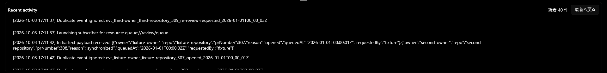

# ログ末尾表示と UIA 走査の検証（2026-10-03）

## 変更と検証範囲

通常は Recent activity の最終行へ追従する。ホイール、スクロールバー、上方向のキーで過去ログを読む間は停止し、新着件数と「最新へ戻る」を表示する。時間経過では再開せず、末尾へ戻る操作またはボタンで再開する。追従状態の判断は LogTailViewModel、入力の解釈は Helper、UI 配線は MainWindow に置く。

同値の文字列を ListView の項目に直接使わず、Equals を上書きしない不変の LogDisplayEntry に保持する。本文・重複行・順序・上限200件は維持する。

## 参照同一性の比較

基準コミットは `976006b5ef6b59f39f5e363ea7dea82994c89f29`、比較コミットは `e9ab4d1e99d4686a88b92bceaa4c9c92b51cad75`。Windows 11 Pro build 26300、SDK 10.0.401、loopback fixture と dummy CLI の隔離環境で実施した。

| 条件 | UI 応答停止 |
|---|---:|
| 基準版、通常サイズ、画像のみ | 0/5 |
| 基準版、最大化、画像のみ | 0/5 |
| 基準版、通常サイズ、UIA tree | 0/5 |
| 基準版、最大化＋ログ末尾表示＋UIA tree | 5/5 |
| 比較版、同じ末尾表示＋UIA tree | 0/5 |
| 比較後に基準版へ戻す | 1/1 |

探索・追加対照を含め全28試験。全試験で isolated=true、realSettingsUnchanged=true、findings=[]。比較版の5回とも、同じ時刻・本文の項目が UIA tree に2個残っていることを確認した。

一致する Microsoft symbols による native dump 解析で、UI thread の PropertyValue::AreEqual → ContainerFromItem → ItemAutomationPeer → UiaNodeTraverser::Traverse を確認した。反復5回の Mini dump すべてに GetNextSibling、4回に AreEqual がある。参照同一性と再現経路の関係を支持するが、内部 sibling cycle の完全な証明とはしない。

## 末尾操作の実画面検証

コードの検証コミットは `7a598929e88969ee07307a4dc1e6bff263ab9586`。隔離 run `20261003-171044-log-tail-deferred` で Windows MCP を使用した。Computer Use の native pipe は接続できなかった。直接 PowerShell UIAutomation は併用していない。

- 最大化後、UIA tree の LogList が末尾100%で、新しい最終行を表示。
- 上向きホイールで追従停止。過去行の時刻と位置を維持し、新着表示が16件から40件へ増加。
- 「最新へ戻る」で末尾100%へ移動し、ボタン・新着表示が消える。その後の追記にも追従。
- 上向きホイールの後、下向きホイールで末尾へ戻ると追従再開。
- スクロールバー操作で停止し、新着件数が増加しても表示している過去行を維持。
- 停止中の通常サイズへの復元・再最大化で停止状態と過去行を維持。ボタンで再開。

途中の失敗も保存した。`1dd59d5` はホイール後にレイアウトが古い末尾位置を報告して早期再開したため、実際に末尾を離れたことを追跡するよう修正。`c8d84a7` は LayoutUpdated 内の直接スクロールで LayoutCycleException が発生したため、UI キューへの延期と、追記・サイズ変更時だけのスクロール要求に修正した。

MainWindow の行数上限は1473から1503へ更新した（実測1502）。追加は入力、レイアウト、ViewModel と UI の配線であり、追従状態の判断と新着件数はテスト対象の ViewModel に置いている。

約300秒の296サンプルで hang=false、lastResponding=true。終了検査は isolated=true、realSettingsUnchanged=true、findings=[]。

## 証跡と未検証事項

証跡は `%LocalAppData%\SquirrelNotifier\investigations\2026-10-03` に保存。`investigation-report.md`、`matrix-results.json`、`evidence-sha256.json`、各試験の画像・UI tree・process-samples・dump・終了検査を参照する。末尾操作の証跡は `log-tail-implementation` 配下。dump と実環境のログはリポジトリへ追加しない。

元の #452 にある InvokePattern-only の reviewer 起動 → ライブログ終了 → 購読停止は未検証。Windows MCP のマウス操作をその合格証拠に代用しない。トレイからの再表示もこの実画面検証では未実施。この検証はリリースランブックの合格結果ではなく、#452 の自動クローズもしない。

## 独立レビュー後の境界条件修正

PR #470 の指摘4172321772を受け、末尾から24px以内でも実際に末尾を離れたことを検出するよう修正。下向き入力による復帰時だけ24pxの許容幅を使い、上向き移動後の通知だけで早期再開しない。ホイールの小移動・スクロール可能高さ24px以下・スクロールバー・Down/PageDown/Endの往復を含む10ケースを追加し、追従ViewModelの全37ケースが成功した。この追加境界条件は状態遷移テストでの検証であり、上記の実画面検証SHAと区別する。
